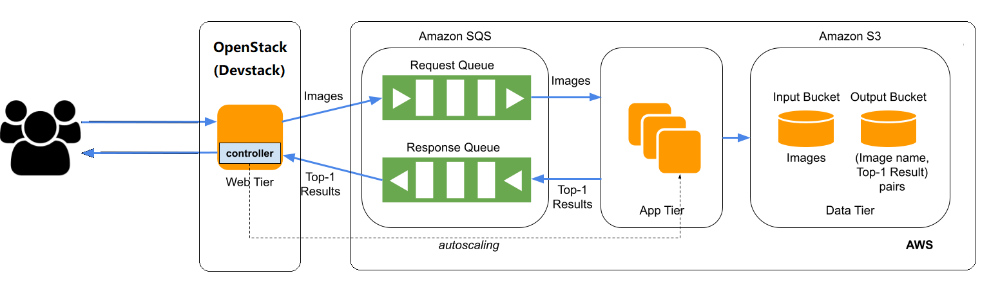

# Hybrid Cloud Elastic Image Recognition

## Overview

This project presents an elastic image recognition program that utilizes Amazon AWS's public cloud and Openstack's private cloud to simulate a hybrid cloud environment. The program autoscales depending on the image recognition demand. The AWS services heavily used in this project are the Elastic Compute Cloud (EC2), Simple Queue Service (SQS), and Simple Storage Service (S3). For the private cloud, we employed Openstack.

## Architecture
The architecture of the program is composed of four main parts:

1. **Web Tier (Openstack compute instance)**: Serves as the web tier hosted on a Linux instance running on Openstack. The web-tier code is uploaded to this instance using SSH.

2. **Queues for requests and responses (Amazon SQS)**: These queues serve as buffers to manage the message delay brought on by the image recognition logic's processing time.

3. **Application Tier (EC2 and AMI)**: The application tier houses the AMI with the image recognition model.

4. **Input and Output Container (Amazon S3)**: User-submitted photos are stored in the input bucket and the classified label for the associated image is stored in the output bucket.

## Autoscaling

This project uses autoscaling, one of the core features of cloud computing. The number of instances are increased when the number of requests rises and decreased when the number of requests fall.

## Testing and Evaluation

We first checked if the code files we moved to our ec2 instances were executing independently. We then examined the photos to see if they were moving from beginning to end without interruptions. We also simulated the full load by sending 100 requests from the workloadGenerator and kept an eye on the flow. 

## Running the Program

Detailed instructions on how to run the program are available in the Code section.

## Code

The program consists of multiple Python files including:

- `appTier.py` (Web Tier): Mainly serves as a link between the user and the input queue. It intercepts the API request and retrieves the image that the user sent for classification.
- `recognition.py` (App Tier): Consumes messages from the input queue, processes each message for further classification, and manages classified images.
- `outputQueueListener.py` (Web Tier): Checks the output queue for fresh messages.

Steps to run the program and details about these files are [here](./code/README.md).
